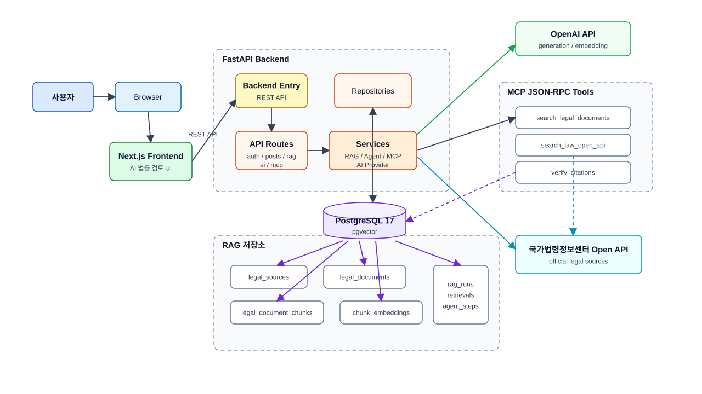
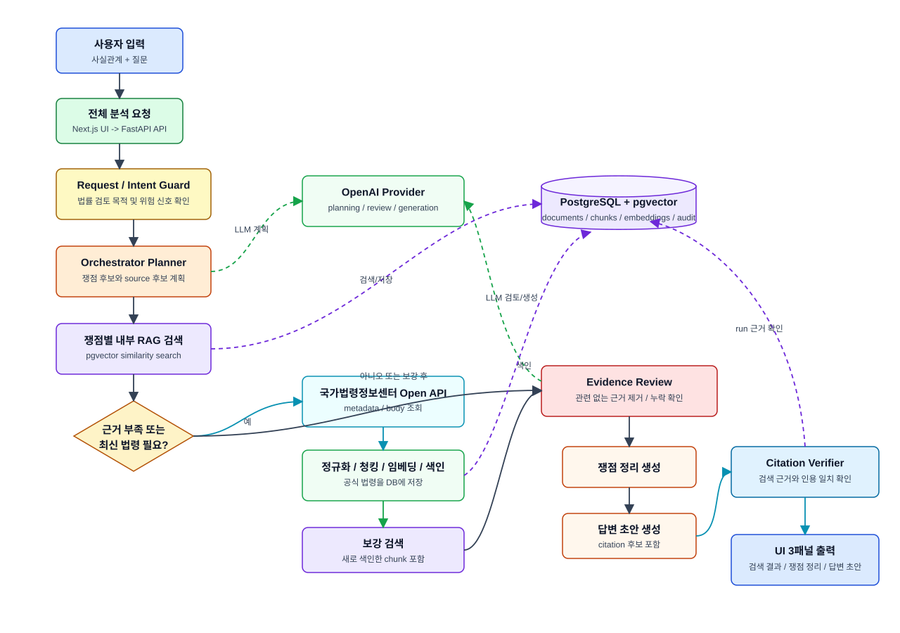
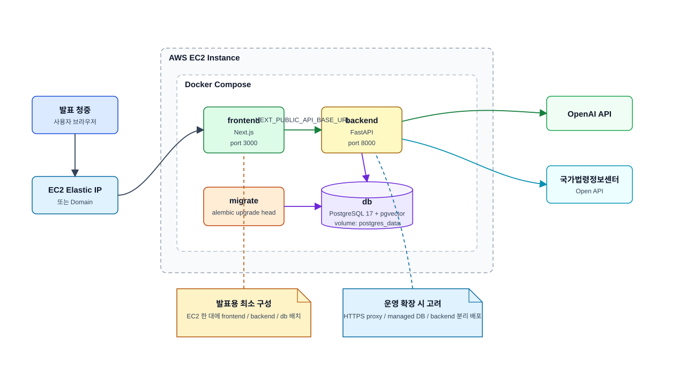

# 시스템 소개

## 1. 프로젝트 개요

이 시스템은 사용자가 입력한 법률 분쟁 사실관계와 질문을 바탕으로 공식 법령 근거를 검색하고, 쟁점을 정리하며, 답변 초안을 작성하는 AI 법률 검토 보조 애플리케이션입니다.

핵심 목표는 LLM이 단독으로 답변을 생성하는 것이 아니라, RAG와 citation 검증을 통해 사용자가 확인 가능한 근거를 함께 제공하는 것입니다.

```text
사실관계 입력
  -> 쟁점 및 필요한 법률 source 계획
  -> 공식 법령 데이터 수집/색인
  -> 내부 RAG 검색
  -> 근거 검토 및 citation 검증
  -> 쟁점 정리
  -> 답변 초안
```

## 2. 해결하려는 문제

법률 분쟁 검토에서는 다음 문제가 자주 발생합니다.

- 사용자가 사실관계를 길고 불완전하게 설명한다.
- 어떤 법률 영역의 쟁점인지 먼저 분류해야 한다.
- LLM이 근거 없이 그럴듯한 법률 답변을 생성할 수 있다.
- 최신 법령과 공식 source 여부를 확인해야 한다.
- 답변 초안에는 근거와 불확실성이 함께 표시되어야 한다.

이 프로젝트는 위 문제를 다음 방식으로 완화합니다.

- 공식 법령 source와 사용자 입력을 분리한다.
- 법률 근거는 RAG 검색 및 citation 검증을 거친다.
- 검색 결과, 쟁점 정리, 답변 초안을 화면에서 병렬로 확인할 수 있게 한다.
- Agent 실행 단계와 검색 근거를 DB에 남겨 재현성과 디버깅 가능성을 확보한다.

## 3. 사용자 흐름

1. 사용자가 `AI 법률 검토` 화면에서 사실관계와 질문을 입력한다.
2. 검색 설정을 선택한다.
   - `집중 답변`: 답변 작성에 바로 쓸 좁은 근거를 검색한다.
   - `쟁점 탐지`: 여러 쟁점 후보를 넓게 찾는 방향으로 검색한다.
3. 사용자가 `전체 분석`을 실행한다.
4. 시스템은 내부 RAG와 필요한 경우 공식 법령 API 조회를 수행한다.
5. 화면에는 다음 결과가 병렬로 표시된다.
   - 검색 결과
   - 쟁점 정리
   - 답변 초안

## 4. 전체 아키텍처

시스템은 Next.js frontend, FastAPI backend, PostgreSQL/pgvector DB, 외부 AI/법령 API로 구성됩니다.

```text
Browser
  -> Next.js frontend
  -> FastAPI backend
  -> Service layer
  -> Repository layer
  -> PostgreSQL + pgvector
  -> OpenAI API / 국가법령정보센터 Open API
```

주요 책임은 다음과 같습니다.

| 계층 | 책임 |
| --- | --- |
| Frontend | 입력 UI, 검색 설정, 결과 표시, API client |
| API route | 인증, 요청/응답 schema, service 호출 |
| Service | RAG, ingestion, chunking, embedding, retrieval, Agent orchestration |
| Repository | DB 조회 및 저장 |
| Database | 문서, chunk, embedding, RAG run, retrieval, agent step 저장 |
| External APIs | OpenAI generation/embedding, 국가법령정보센터 공식 법령 데이터 |

## 5. RAG 데이터 흐름

RAG pipeline은 다음 단계를 가집니다.

1. Source acquisition
   - fixture, 사용자 입력 문서, 국가법령정보센터 Open API 등에서 원천 데이터를 가져온다.
2. Normalization
   - HTML/XML/JSON 등 외부 응답을 검색 가능한 텍스트와 metadata로 정리한다.
3. Deduplication and versioning
   - `raw_checksum`, `normalized_checksum`, `canonical_id`, `version_label`, `effective_date`로 중복과 버전을 구분한다.
4. Chunking
   - 법령 조문 구조를 우선 보존하면서 citation 가능한 단위로 자른다.
5. Embedding
   - `embedding_profiles`에 provider/model/dimension 정보를 저장하고, chunk별 embedding을 저장한다.
6. Retrieval
   - pgvector 기반 similarity search를 수행한다.
7. Evidence review
   - 관련 없는 근거를 제거하고 누락된 쟁점이 있는지 검토한다.
8. Citation validation
   - 최종 초안에서 인용한 근거가 실제 검색 결과에 존재하는지 확인한다.

## 6. Agent와 MCP 구조

MVP의 Agent는 단일 Orchestrator Agent입니다. 이 Agent는 LLM이 제안한 action을 그대로 실행하지 않고, 서버가 허용한 action과 tool만 검증 후 실행합니다.

주요 MCP tool:

- `search_legal_documents`
  - 내부 pgvector 기반 RAG 검색
- `search_law_open_api`
  - 국가법령정보센터 Open API 조회
- `verify_citations`
  - 답변 초안의 citation이 검색 근거에 의해 뒷받침되는지 확인

Agent는 다음 guard를 가집니다.

- 최대 반복 횟수
- 최대 tool call 수
- 반복 action 제한
- timeout
- citation repair 제한
- 요청 의도 및 prompt injection risk 검토

향후 확장 구조는 Supervisor Agent와 도메인별 전문 Agent입니다.

```text
SupervisorAgent
  -> Issue/Domain Planner
  -> CriminalLawAgent
  -> CivilLawAgent
  -> LaborLawAgent
  -> AdministrativeLawAgent
  -> LeaseLawAgent
  -> EvidenceVerifierAgent
  -> SynthesisAgent
```

## 7. 주요 데이터 모델

| 모델 | 역할 |
| --- | --- |
| `legal_sources` | 원천 provider, external id, source URL, fetch metadata |
| `legal_documents` | 법령/문서 본문, checksum, version, indexing 상태 |
| `legal_document_chunks` | citation 가능한 검색 단위 |
| `embedding_profiles` | provider, model, dimension, distance metric |
| `legal_document_chunk_embeddings` | chunk별 embedding vector와 embedding 상태 |
| `rag_runs` | 검색/쟁점정리/답변초안 실행 단위 |
| `rag_retrievals` | run별 검색 결과와 rank/score |
| `agent_steps` | Agent planning, tool call, 검증, 실패 이력 |

## 8. 현재 구현 범위

현재 발표용 MVP에서 안정적으로 보여주는 핵심 흐름은 다음입니다.

- 회원가입/로그인
- 게시판 기능
- `AI 법률 검토` 화면
- 법령 중심 공식 source 조회 및 색인
- pgvector 기반 검색
- OpenAI 기반 Agent 응답 생성
- 검색 결과, 쟁점 정리, 답변 초안 병렬 표시
- citation 기반 답변 보조

다음 영역은 후속 확장 대상입니다.

- 판례 본문 수집/청킹/임베딩
- 법령해석례, 행정심판례 수집/청킹/임베딩
- 사용자 PDF/스캔 문서 업로드와 OCR pipeline
- hybrid search와 reranking
- 도메인별 multi-agent workflow
- LangGraph 기반 durable workflow
- 정량 평가 dataset과 회귀 평가 자동화

## 9. 발표 시 강조할 포인트

- 단순 ChatGPT wrapper가 아니라, 법령 source, chunk, embedding, retrieval, citation, audit를 분리한 구조이다.
- 공식 법령 API를 통해 최신 법령 source를 가져오는 방향으로 설계했다.
- embedding model/dimension을 고정하지 않고 `embedding_profiles`로 분리했다.
- MCP tool과 Agent action을 allowlist로 제한했다.
- 결과 UI를 검색 근거, 쟁점 정리, 답변 초안으로 나누어 사용자가 검토할 수 있게 했다.
- 현재 한계를 명시하고, 판례/해석례/행정심판례와 multi-agent 확장 계획을 문서화했다.

## 10. 다이어그램

### 전체 시스템 아키텍처



원본: [Mermaid](diagrams/system-architecture.mmd) / [draw.io](diagrams/system-architecture.drawio)

### RAG/Agent 처리 흐름



원본: [Mermaid](diagrams/rag-agent-flow.mmd) / [draw.io](diagrams/rag-agent-flow.drawio)

### 발표용 배포 토폴로지



원본: [Mermaid](diagrams/deployment-topology.mmd) / [draw.io](diagrams/deployment-topology.drawio)
