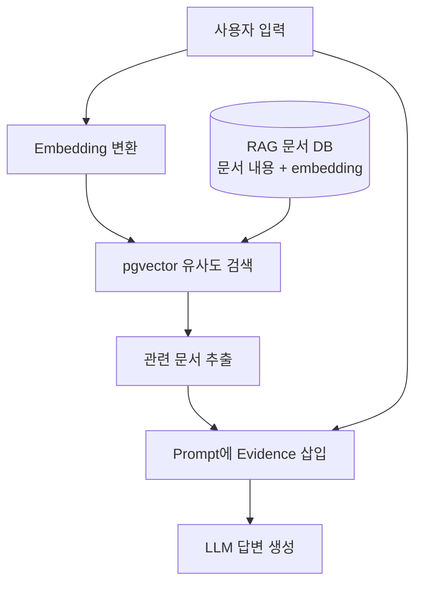

```mermaid
flowchart TD
    A["사용자 입력"]
    B["Embedding 변환"]
    C["pgvector 유사도 검색"]
    D[("RAG 문서 DB<br/>문서 내용 + embedding")]
    E["관련 문서 추출"]
    F["Prompt에 Evidence 삽입"]
    G["LLM 답변 생성"]

    A --> B
    B --> C
    D --> C
    C --> E
    E --> F
    A --> F
    F --> G
```